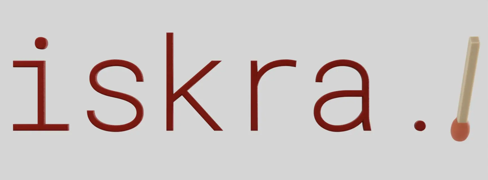

# Iskra ✨ - Tensor Geometry Processing



This repository contains a lightweight geometry processing library that is meant to be a one-stop-shop for all of your geometric needs. Iskra is:
* modern and Python-first,
* non-intrusive,
* fully differentiable (if needed),
* functionality-wise on pair with `gptoolbox`,
* actievely maintained.

## Obtaining Iskra ✨

If you want to pull any of the notebooks in this repository, you will need to have [Git LFS](https://docs.github.com/en/repositories/working-with-files/managing-large-files/configuring-git-large-file-storage) installed on your system. If not, here are the instructions to help you get set up:
```
# Pick one of the following depending on your distribution:
sudo apt install git-lfs  # on Ubuntu
brew install git-lfs  # on MacOS

# Verify that the installation was successful:
git lfs install
```

Set up conda dev environment with the following snippet:
```
conda env create -f environment.yaml
conda activate iskra
```

## Development

Lastly, if you plan on contributing, you will also need the development dependencies, and compile the C++ extensions.
This can be done by running the following:
```
conda env update -f environment-dev.yaml
pip install --no-build-isolation -Ceditable.rebuild=true -ve .
```

### Development Plan
- [ ] Import code from other repos.
- [ ] Figure out dependency management for deployment.

## FAQ
- Why the name? 
    - Iskra means spark in Serbo-Croatian, which alludes to it being a PyTorch library, but mostly I think it sounds cool.