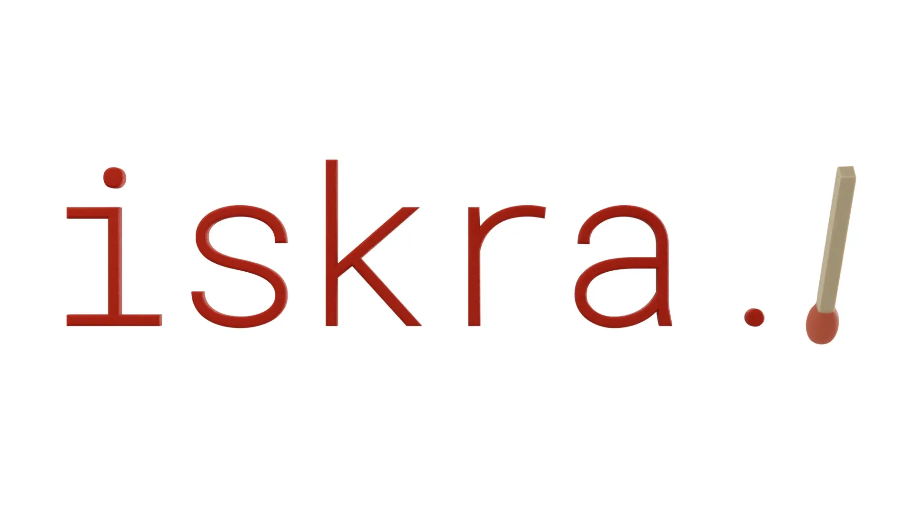

# Iskra ✨ - Tensor Geometry Processing



This repository contains a lightweight geometry processing library that is meant to be a one-stop-shop for all of your geometric needs. Iskra is:
* modern,
* Python-first,
* simple by default, powerful when needed,
* fully differentiable (if needed),
* functionality-wise on pair with `gptoolbox`,
* actievely maintained.

## Obtaining Iskra ✨

If you want to pull any of the notebooks in this repository, you will need to have [Git LFS](https://docs.github.com/en/repositories/working-with-files/managing-large-files/configuring-git-large-file-storage) installed on your system. If not, here are the instructions to help you get set up:
```
# Pick one of the following depending on your distribution:
sudo apt install git-lfs  # on Ubuntu
brew install git-lfs  # on MacOS

# Verify that the installation was successful:
git lfs install
```

Change into the cloned iskra directory and install it to your active environment using:
```
pip install .
```

## Development
Lastly, if you plan on contributing, you will need the development dependencies and to compile the C++ extensions in editable mode.
This can be done by running the following:
```
conda env create -f environment.yaml
conda env update -f environment-dev.yaml
conda activate iskra
pip install --no-build-isolation -Ceditable.rebuild=true -ve .
```

### Development Plan
- [ ] Import code from other repos.
    - [X] Topology operations.
    - [ ] Differential operators: d_01, grad, div, laplacian, mass matrices, etc.
        - [ ] Refactor mass and intrinsic volume computation.
    - [ ] Mesh loading and saving.
- [ ] Basic batched learning support.
- [ ] Make sure everything is tested.
- [ ] Add sphinx documentation.
- [ ] Figure out dependency management for deployment.
- [ ] NumPy and DLPack support with no copies using `torch.from_numpy` and `torch.from_dlpack`.
- [ ] Missing `gptoolbox` functions:
    - [ ] adjacency_dihedral_angle_matrix.m
    - [ ] adjacency_edge_cost_matrix.m
    - [ ] adjacency_incident_angle_matrix.m
    - [ ] alpha_complex.m
    - [ ] arap.m
    - [ ] arap_dof.m
    - [ ] arap_energy.m
    - [ ] arap_gradient.m
    - [ ] arap_hessian.m
    - [ ] arap_linear_block.m
    - [ ] arap_rhs.m
    - [ ] arc_to_cubics.m
    - [ ] axisanglebetween.m
    - [ ] ... ?

## FAQ
- Why the name? 
    - Iskra means spark in Serbo-Croatian, which alludes to it being a PyTorch library, but mostly I think it sounds cool.